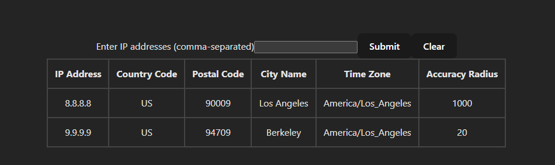

## IP Locator tool

This a simple tool to look up an IP address and return the country the IP address belongs to.

## Getting started

In the root directory, to start both the frontend and backend applications, run the following command

```sh
make up
```

Note: This command will install all the dependencies for both the frontend and backend applications. This requires the make utility to be installed on your machine. This also assumes that you have a more recent version of node and npm installed on your machine. This command will take a while to compile react and run the backend application.

There is only one route in the frontend application which is the `http://localhost:3000/`. This is a simple form that takes multiple comma-separated IP addresses and returns details about the IP addresses.


Example: 



## Running tests

### To run tests
Since the tests run on the same port, you will need to stop the application before running the tests. To stop the application, run the following command

```sh
make down
```
AND then run

```sh
make test-backend
```
AND
```sh
make test-frontend
```